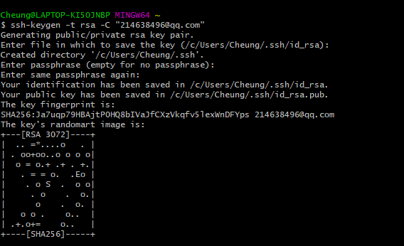
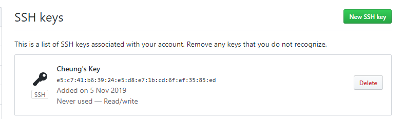
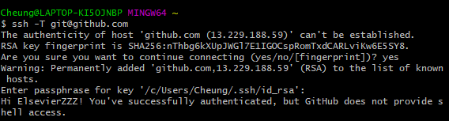
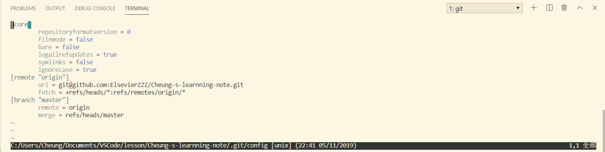
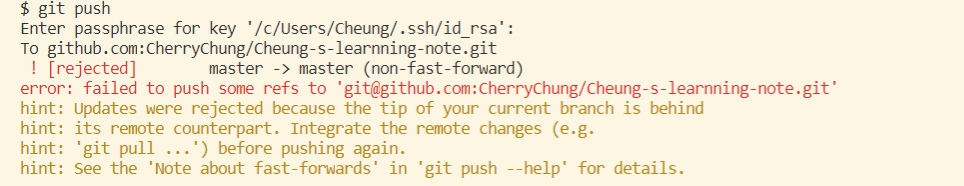

### 作者 [日]
**关键字**：

版本管理·分支·合并·Fork·Issue·BUG管理·任务管理·Markdown·代码审查·社会化编程·Jenkins Github Flow·Git Flow·hub命令

### 快速入门

- 版本管理
- [ ] 集中型
- [x] 分散性

Fork
<!-- 将GitHub中的某个特定仓库复制到自己的账户下，fork出的仓库和原仓库是两个不同的仓库，用户可以随意编辑 -->

- 初始设置
<!-- user.name/cheung
user.email/214638496 -->

- 设置SSH KEY

<!-- 密码为斜杠 -->

- 认证与通信

### 分支的操作
<!-- 可以在互不影响前提下对多个功能进行开发 -->
- git branch
<!-- 查看分支一览表 -->
- git checkout -b feature-a
<!-- 创建分支feature-a -->
- git checkout master
<!-- - 切换回master分支 -->
- git merge
<!-- - 分支合并 -->
  - git checkout master
  <!-- - 切换回master分支 -->
  - git merge --no-ff feature-a
  <!-- - 创建合并提交 -->
  - 
### 
[Git常用指令总结 | Luozm's Blog](https://luozm.github.io/git)

### 奇巧
git 修改配置

git push的时候报错
